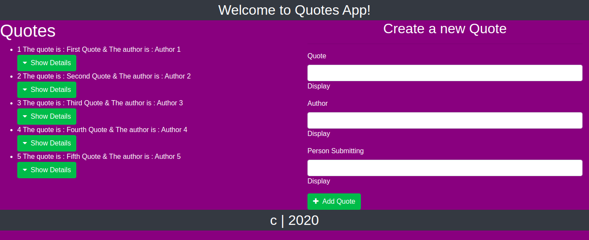

# THE QUOTES APP
   https://jimmy-oss.github.io/goal/
   
   

# PROJECT DESCRIPTION
This project is comprised of a display which shows all the quotes saved on the system.
    It consists of a form which add more quotes into the system.
# THE HEADER DESCRIPTION SECTION
The user gets a header section at the top of the page with the title of the app.
# BEHAVIOUR DRIVEN DEVELOPMENT
The project consists of components which are found in the app such as the header& footer.
These are components which help to finalize the index.html in details.
# TECHNOLOGIES USED
These are:<ul>
        <li>CSS</li>
        <li>Markdown</li>
        <li>Angular cli</li>
        <li>Bootsrap</li>
        <li>HTML</li>
        <li>Javascript</li>
             </ul>
# THE AUTHOR
If there is a pending information I can use to improve the project please feel free to email,
that is jimmynjonge51@gmail.com.
# THE LICENSE
The app is under mit license.
